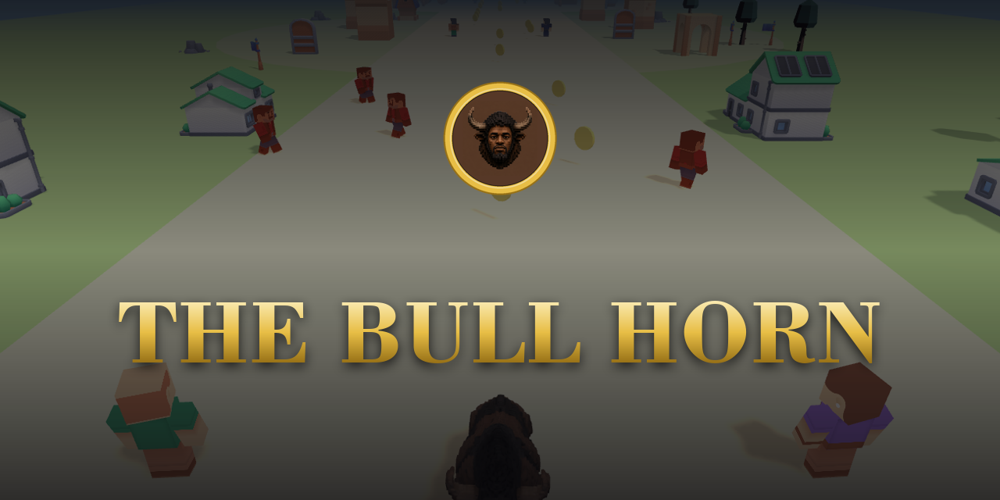

<p align="center">
  
</p>

<h1 align="center">🐂 THE BULL HORN</h1>

<p align="center">
  <b>Charge as a bull. Become a minotaur. Clear the realm.</b><br>
  A one‑click <b>3D action game</b> for the browser — three realms, one shape‑shifting beast.<br>
  <br>
  
  
  
  
</p>

---

## ✨ What is it?

**THE BULL HORN** is a playable 3D game with a meme‑coin identity (**`$MESNA`**). No sign‑up —
press **Play** and you're in. You control a beast that **charges as a bull** and **transforms into a
minotaur**, fighting through three escalating game modes:

| # | Realm | Mode |
|---|-------|------|
| **I** | 🌲 **The Adventure** | Walkable RPG through 5 towns — fight, level up, beat the **Rust King** |
| **II** | 🏃 **The Run** | Endless runner — dodge, jump, slide, smash, outrun **The Devourer** |
| **III** | 🔥❄ **Ice & Fire** | Boss arena — transform + melee + **shoot fire** at big monsters, 6 waves + boss |

Clear Level 3 to trigger the **victory + `$MESNA` reward claim** (connect Phantom to claim).

It runs on **plain shared hosting** — static front end + **PHP/MySQL**, all 3D in **Three.js**,
**no build step**.

---

## 🎮 How it plays

1. **Play** → choose **Connect Phantom** or **Play as Guest** (instant).
2. **Level 1:** walk the road through five towns, fight foes, collect gold, level up, **transform**
   (bull ⇄ minotaur), and fell the **Rust King**.
3. **Level 2:** auto‑run the 3‑lane gauntlet — **◀ ▶** lanes, **Space** jump, **S** slide,
   **J** smash — and reach the gate.
4. **Level 3:** survive **6 waves** of Frost Wraiths & Magma Brutes using **transform + melee + fire**,
   defeat the **Ashen Warden**, and **claim your reward**.

### Controls
| Action | Desktop | Mobile |
|--------|---------|--------|
| Move | WASD / Arrows | left joystick |
| Transform | **F** | 🔄 |
| Melee | **J** | 👊 / 🐂 |
| Jump | **Space** | ⤒ |
| Shoot fire (L3) | Click / **L** | 🔥 |
| Potion (L1) | **H** | 🧪 |

---

## 🚀 Run it locally

Requires **PHP 8+** (MySQL optional locally — it falls back to SQLite).

```bash
cd public_html
PHP_CLI_SERVER_WORKERS=8 php -S 127.0.0.1:8899
# open http://127.0.0.1:8899
```

> The multi‑worker flag matters — the browser loads several 3D models at once, and a single‑threaded
> PHP server will choke on the concurrent requests.

On macOS you can also double‑click **`RUN-LOCAL.command`**.

---

## 🌐 Deploy to shared hosting (Hostinger / cPanel)

1. **Upload** everything inside **`public_html/`** to your host's `public_html` (or a subfolder).
2. **Database:** create a MySQL database + user, import **`struktur.sql`**.
3. **Secrets:** copy **`config.php.example`** → **`config.php`** and fill in your DB credentials
   (and any API key). **`config.php` holds secrets and must never be committed or exposed.**
4. **Marketing:** edit **`public_html/config.js`** (see below) for CA, socials, launch date.
5. Open your domain — done. See **`DEPLOY.md`** for the step‑by‑step.

A ready‑to‑upload archive is produced at **`IRONHOLD-deploy.zip`**.

---

## ⚙️ CONFIG — edit your CA & social links here

Everything marketing‑related lives in **one file** you can edit directly on the server
(cPanel File Manager), **no rebuild needed**:

**`public_html/config.js`**
```js
window.SITE_CONFIG = {
  gameName: "THE BULL HORN",
  tagline:  "Charge as a bull. Become a minotaur. Clear the realm.",

  launchISO: "2026-07-05T00:00:00Z",     // launch countdown target

  token: {
    ca:          "PASTE_CONTRACT_ADDRESS_HERE",  // 👈 your $MESNA contract address
    caLive:      false,                          // 👈 set true once the CA is live
    buyUrl:      "https://pump.fun/coin/...",    // 👈 buy link
    tokenSymbol: "$MESNA"
  },

  socials: {
    twitter:  "",   // 👈 https://x.com/...
    telegram: "",   // 👈 https://t.me/...
    discord:  "",   // 👈 https://discord.gg/...
    website:  "",
    other:    ""
  }
};
```

> ⚠️ **Never** put the database password or any API key in `config.js` (it ships to the browser).
> Secrets go only in server‑side **`config.php`**.

---

## 🧱 Tech & structure

- **Front end:** Vanilla JS + **Three.js r128** (vendored, offline) + GLTFLoader. Art = **Kenney**
  GLB kits; the hero bull/minotaur are **Meshy** skinned GLBs.
- **Back end:** **PHP 8 + MySQL** (guest identity + save). Local dev falls back to SQLite.

```
public_html/
├── index.html          landing page (live 3D bull + minotaur, countdown, CA, socials)
├── game.html           the game shell (3 levels)
├── config.js           👈 EDIT: CA, buy link, socials, launch date
├── css/                theme + game styles
├── js/
│   ├── explore.js      Level 1 — adventure engine (bull/minotaur, towns, combat)
│   ├── runner.js       Level 2 — endless runner
│   ├── level3.js       Level 3 — ice & fire boss arena (transform + melee + fire)
│   ├── hero3d.js       landing: minotaur move‑set reel
│   ├── bull3d.js       landing: walking bull
│   ├── wallet.js       optional Phantom connect + reward claim
│   ├── adventure.js    controller / UI wiring / level flow
│   └── vendor/         three.min.js, GLTFLoader.js (offline)
├── assets/models/      Kenney kits + bison (bull/minotaur) GLBs
├── assets/img/         logo, banners, hero art
└── *.php               guest / save endpoints (config.php holds secrets)
```

---

## 🎨 Brand assets

| Asset | Path |
|-------|------|
| Logo (transparent) | `public_html/assets/img/logo/logo.png` |
| Square logo | `public_html/assets/img/logo/logo-stacked.png` |
| Coin badge / favicon | `public_html/assets/img/logo/bison-badge.png` |
| X / Twitter banner (1500×500) | `public_html/assets/img/banner-x.png` |
| GitHub / social banner (1280×640) | `public_html/assets/img/banner-github.png` |

---

## 🙏 Credits
- 3D kits: **[Kenney](https://kenney.nl)** · Hero models: **Meshy** · Engine: **Three.js**
- Token: **`$MESNA`** on **Solana** via **pump.fun**

<p align="center"><i>Charge as a bull. Become a minotaur. Clear the realm.</i></p>
